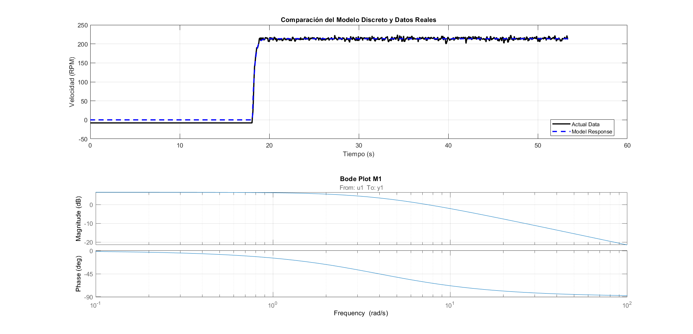
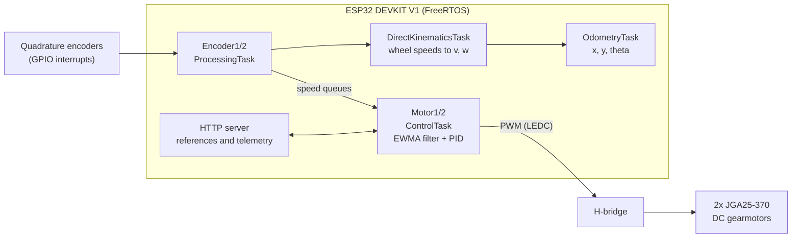
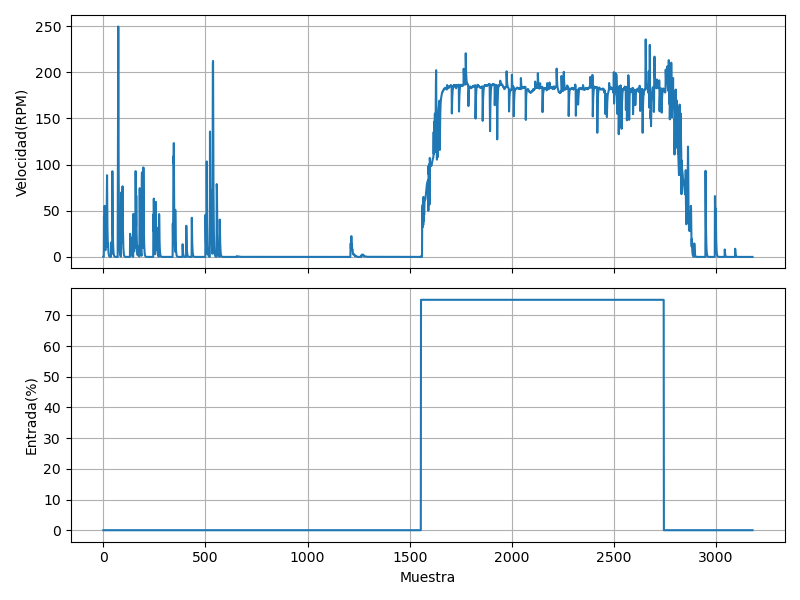
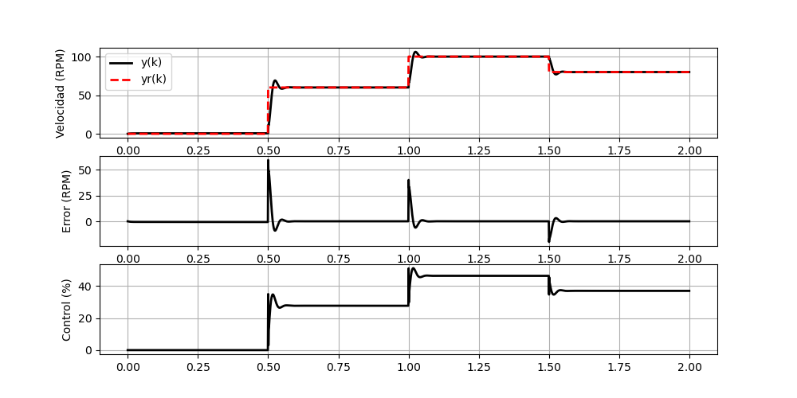

# Differential Drive Robot Control System

Closed-loop control for a two-wheel differential robot on an ESP32 running FreeRTOS: encoder processing, PID speed control, forward and inverse kinematics, odometry, and a WiFi HTTP API. Every controller was derived from system identification experiments on the motors.



<!-- TODO: add short GIF of the robot driving -->

## Why this exists

Built for the Robotics class at [Universidad Católica Boliviana](https://www.scz.ucb.edu.bo), this project walks the full control-engineering loop on real hardware: identify the plant, design and simulate the controller, implement it on an RTOS, then measure how well reality matches the model. The repo keeps all of it, from firmware to the raw experiment data and analysis scripts.

## System architecture

Six FreeRTOS tasks cooperate through queues, pinned across the ESP32's two cores:



- **Encoder tasks** count quadrature pulses via GPIO interrupts and hardware timers, and convert them to RPM.
- **Motor control tasks** smooth the noisy speed signal with an EWMA filter, then run a PID loop (or open loop, selectable) with output saturation before writing the PWM duty cycle.
- **Kinematics and odometry tasks** turn wheel speeds into robot velocity `(v, w)` and integrate pose `(x, y, theta)`.

### HTTP API

The robot connects to WiFi on boot and exposes its control interface over HTTP, so it can be commanded and logged from any laptop:

| Endpoint | Purpose |
|---|---|
| `/status` | Health check |
| `/reference1/set`, `/reference2/set` (and `/get`) | Per-wheel speed references |
| `/encoder1/get`, `/encoder2/get` | Measured wheel speeds |
| `/robot/speed/set`, `/robot/speed/get` | Body velocity `(v, w)`, converted to wheel references via inverse kinematics |
| `/robot/distance/get`, `/robot/distance/reset` | Odometry readout |

## Control design workflow

The controllers came out of a measured, repeatable process. All scripts and raw data live in [`automation/`](automation/):

1. **Signal acquisition** ([`automation/lab_01/`](automation/lab_01/)): step and sine excitation over serial and WiFi, logging encoder response.
2. **Filtering**: EWMA filter tuning to clean the encoder signal without adding excessive lag.

   

3. **System identification** ([`automation/lab_02/`](automation/lab_02/)): fitting a discrete transfer function per motor from step-response data (MATLAB and Python), validated against measurements (figure at the top).
4. **Controller simulation**: PID designed against the identified model before touching hardware.

   

5. **Kinematics and odometry validation** ([`automation/lab_03/`](automation/lab_03/)): commanded vs measured trajectories, analyzed in a [Jupyter notebook](automation/lab_03/data/odometry_analysis.ipynb).

## Repository layout

| Path | Contents |
|---|---|
| [`main/src/`](main/src/) | ESP-IDF firmware: [`motor_control/`](main/src/motor_control/), [`encoder/`](main/src/encoder/), [`task_utils/`](main/src/task_utils/) (FreeRTOS tasks), [`web_server/`](main/src/web_server/), [`http_handlers/`](main/src/http_handlers/), [`connect_wifi/`](main/src/connect_wifi/) |
| [`automation/`](automation/) | Experiment scripts, raw data, and analysis (Python, MATLAB, Jupyter) |
| [`documentation/CAD/`](documentation/CAD/) | SolidWorks parts and 3D-printable chassis files |
| [`documentation/electronics/`](documentation/electronics/) | Pinouts, H-bridge and encoder references |
| [`documentation/experiments/`](documentation/experiments/) | Result figures and lab photos |

## Hardware

- ESP32 DEVKIT V1 (dual-core, WiFi)
- 2x JGA25-370 12 V DC gearmotors with quadrature encoders
- Dual H-bridge motor driver
- 3D-printed chassis and wheel mounts (SolidWorks sources and STL/3MF in [`documentation/CAD/`](documentation/CAD/))

## Build and flash

Requires [ESP-IDF](https://docs.espressif.com/projects/esp-idf/en/stable/esp32/get-started/).

```bash
git clone https://github.com/leonardoAB1/mobile_robot_esp32.git
cd mobile_robot_esp32

# set your WiFi credentials
# edit main/src/config.h (WIFI_SSID, WIFI_PASSWORD)

idf.py set-target esp32
idf.py build flash monitor
```

## Contributors

- [Leonardo Acha Boiano](https://github.com/leonardoAB1)
- [Bruno Ramiro Rejas](https://github.com/BrunoRRM712)
- Gonzalo Peralta
- [Andrés Ayala](https://github.com/mecatrono)

## License

MIT
